# Wie es läuft

Ablaufdiagramme der Teile, die kein Standard-Django sind: was mit wem redet, in welcher Reihenfolge,
und wo man im Code anfängt zu lesen. Anmelden, Registrieren, Passwort zurücksetzen und der Admin
fehlen — das macht Django sowieso.

Jede Box nennt die Datei oder Funktion, für die sie steht. Die Diagramme sind
[Mermaid](https://mermaid.js.org/); GitHub zeichnet sie, und jeder Editor mit Mermaid-Vorschau auch.

1. [Die Teile](#die-teile)
2. [Ein Spiel von Anfang bis Ende](#ein-spiel-von-anfang-bis-ende)
3. [Zugang für Mitspielende](#zugang-für-mitspielende)
4. [Eine Runde vom Zug bis zur Statistik](#eine-runde-vom-zug-bis-zur-statistik)
5. [Routensuche im Browser](#routensuche-im-browser)
6. [Die Simulation](#die-simulation)
7. [Zwischen den Runden](#zwischen-den-runden)
8. [Vom Server auf den Bildschirm](#vom-server-auf-den-bildschirm)
9. [Kartenversionen und Abstimmung](#kartenversionen-und-abstimmung)

## Die Teile

Eine Django-App auf Daphne liefert alles aus, was nicht die SPA ist: die REST-API, die Websockets und
die serverseitig gerenderten Seiten. Die Simulation läuft nie in einer Anfrage — sie läuft auf einem
Celery-Worker, und ihre Ergebnisse kommen über den Websocket bei den Browsern an.

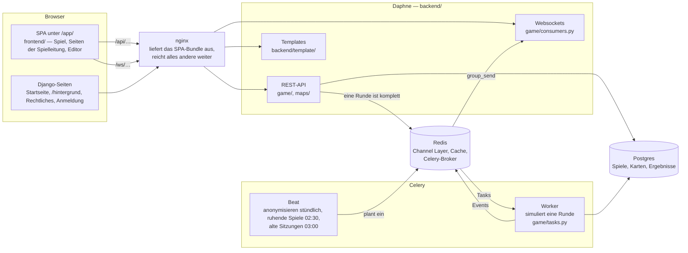

## Ein Spiel von Anfang bis Ende

Ein Spiel ist eine `GameSession`, eine Runde eine `GameRound`. Die Phasen zwischen den Runden haben
[weiter unten](#zwischen-den-runden) ein eigenes Diagramm. Jedes Ende schreibt `end_reason` in dem
Moment, in dem es passiert: `co2_limit`, `max_rounds`, `host` oder `idle`.

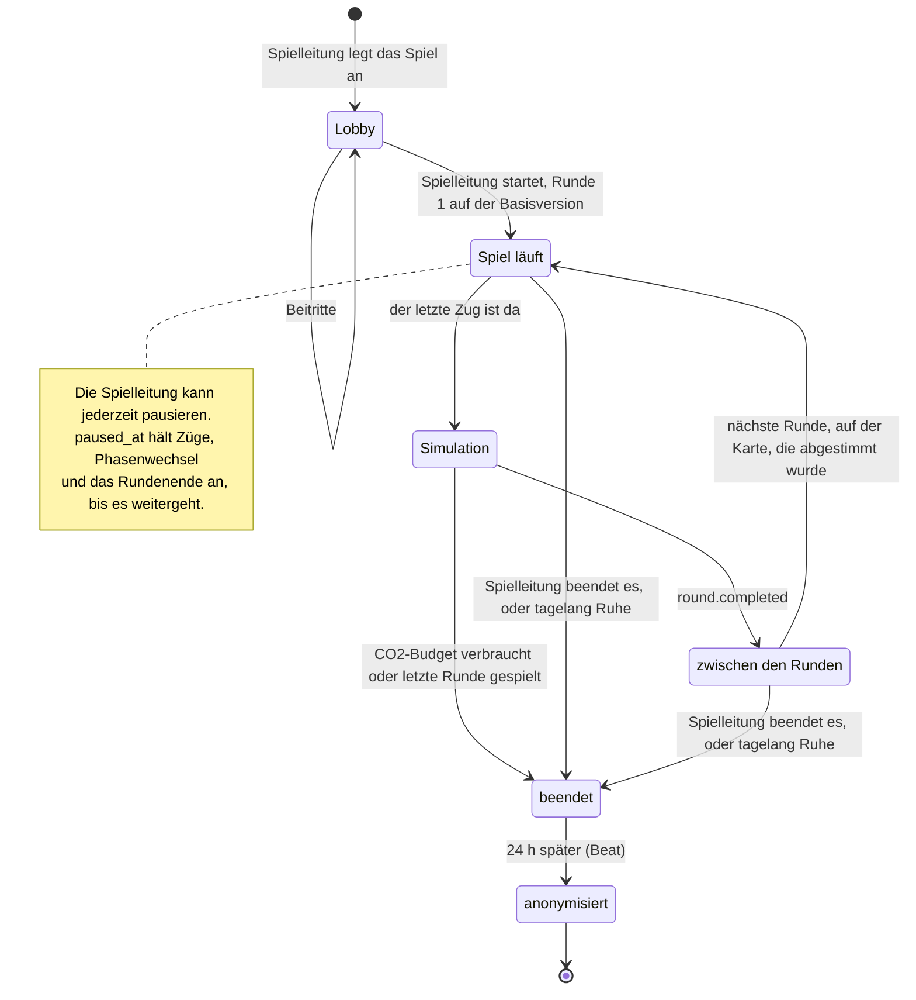

| Schritt                                 | wo man liest                                                   |
| --------------------------------------- | -------------------------------------------------------------- |
| anlegen                                 | `GameSessionListCreateView` in `game/views_rest.py`            |
| beitreten, Zuhause und Ziele            | `JoinSessionAPIView` in `game/views_join.py`, `set_up_player` und `assign_agent_nodes` in `game/signals.py` |
| starten                                 | `GameSessionDetailView.update` in `game/views_rest.py`         |
| Runde komplett, simulieren, beenden     | `game/rounds.py`, dann `handle_round_completed` in `game/signals.py` |
| pausieren, Ende nach Ruhe, anonymisieren | `game/pause.py`, `game/idle.py`, `game/anon.py`               |

## Zugang für Mitspielende

Mitspielende haben kein Konto. Beim Beitreten bekommt der Browser zwei signierte Cookies, und jede
Anfrage und jeder Socket wird gegen sie geprüft. Die Spielleitung ist ein normaler Django-User mit
Sitzung und wird zuerst geprüft.

### Einen Platz bekommen

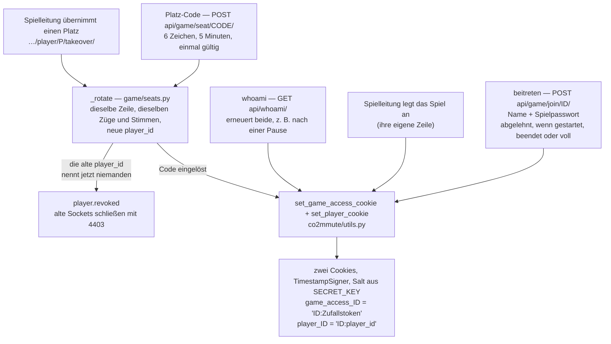

Ein Platz ist eine `Player`-Zeile und kann zwischen Geräten wandern: Die Spielleitung holt einen
Platz an die Leitstelle („Übernehmen“) oder gibt ihn mit einem Code weiter. Keins von beidem kopiert
die Zeile. `_rotate` gibt ihr eine neue `player_id`, und jedes Cookie, das die alte nennt, ist damit
wertlos. Ein übernommener Platz braucht kein Cookie — die Spielleitung handelt mit ihrer Sitzung für
ihn.

### Jede Anfrage

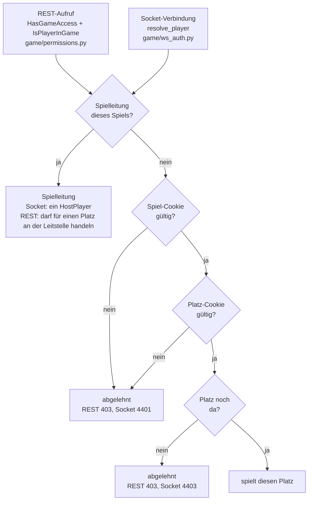

- **Spielleitung dieses Spiels?** Ein angemeldeter Django-User, der `game_host` dieses Spiels ist.
- **Spiel-Cookie gültig?** `has_game_access`: `game_access_ID` hat eine gültige Signatur, ist nicht
  abgelaufen, und die Spiel-ID darin ist die dieses Spiels.
- **Platz-Cookie gültig?** `resolve_player_id`: dieselben Prüfungen für `player_ID`. Bei REST muss
  seine `player_id` außerdem die aus der URL sein — jede `player_id` steht im Roster der Lobby, ohne
  diese Prüfung könnte also jeder für jeden anderen ziehen.
- **Platz noch da?** Eine `Player`-Zeile mit dieser `player_id`, die das Spiel nicht verlassen hat.
  Der Socket lehnt außerdem ein beendetes Spiel ab.

Beide Türen gehen durch `game/auth.py`, das nichts von der Spielleitung weiß. Ein abgelehnter Socket
wird erst angenommen und dann mit seinem Code geschlossen (`refuse()` in `game/consumers.py`) — vor
dem Annehmen geschlossen, sieht der Browser nur 1006 und verbindet sich immer wieder neu.

Zwei Folgen: Wer `SECRET_KEY` wechselt oder ändert, was in einem Cookie steht, wirft alle
Mitspielenden aus allen laufenden Spielen. Und der Name ist das Einzige, was das Spiel über eine
Person weiß; er landet nie in einem Log.

## Eine Runde vom Zug bis zur Statistik

Vom ersten Tippen auf dem Handy bis zur Statistik auf jedem Bildschirm. Die Route wird im Browser
gefunden, der Server prüft sie nur. Die Runde ist komplett, sobald der letzte Platz, der noch
mitspielt, gezogen hat; dann läuft die Simulation auf Celery und meldet sich über den Websocket
zurück.

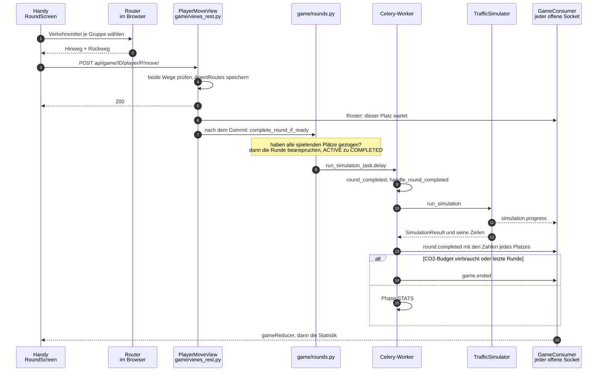

Zwei Regeln halten das zusammen. Es gibt **einen** Entscheidungspunkt, `complete_round_if_ready`, und
alles, was eine Runde abschließen kann (ein Zug, jemand geht), kommt über
`schedule_round_completion_check` dorthin. Und die Runde wird mit einem bedingten `update()`
**beansprucht**, sodass zwei Züge, die im selben Augenblick ankommen, eine Simulation starten und
nicht zwei.

## Routensuche im Browser

Alles hier läuft auf dem Handy (`hooks/use-round-draft.ts`). Der Graph kommt einmal je Runde und
Version vom Server, mit den gemessenen Geschwindigkeiten der letzten Runde dran; die Suche selbst ist
Dijkstra.

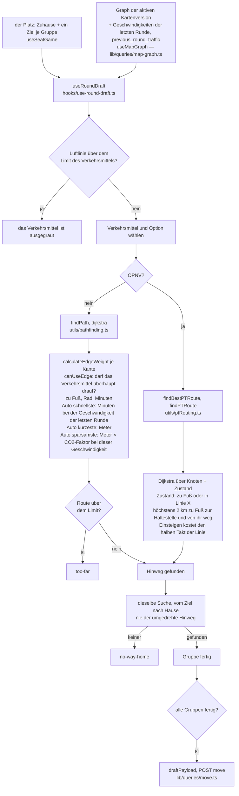

- **Die Limits** sind 5 km zu Fuß und 15 km mit dem Rad (`lib/map/trip-limits.ts`). Die Luftlinie
  wird geprüft, bevor ein Verkehrsmittel gewählt ist — sie kann nur kürzer sein als die Route —, die
  gefundene Route danach.
- **Der Rückweg ist eine eigene Suche.** Eine Einbahnstraße hat keine Gegenkante, auf so einer Karte
  ist der Rückweg also eine andere Route. Der Server lehnt einen Zug ohne Rückweg ab.
- **Der Server prüft, er sucht keine Route.** `_validate_routes` in `game/views_rest.py` prüft, dass
  beide Wege Zuhause und Ziel verbinden und dass jede Kante das Verkehrsmittel erlaubt.
- **Der ÖPNV hat drei Optionen:** „schnellste“, „wenig umsteigen“ (jeder Umstieg nach dem ersten
  Einsteigen kostet in der Suche 30 Minuten extra) und „ohne Bus“.
- **Eine langsame Suche kann keine neuere überschreiben.** Jede Suche trägt ein Token je Gruppe; ein
  Ergebnis, dessen Token nicht mehr das aktuelle ist, wird verworfen.
- **Angefangene Eingaben überleben ein Neuladen** (nur Verkehrsmittel und Optionen, nie eine Route),
  im localStorage, `lib/game/draft-storage.ts`.

## Die Simulation

Ein Warteschlangenmodell je Kante (Link Queue), das mesoskopische Modell, das MATSim benutzt. Was es
rechnet und warum, steht im [`docs/de-hintergrund.md`](de-hintergrund.md); diese drei Diagramme
zeigen, wie der Code aufgebaut ist.

### Zeilen rein, Engine, Zeilen raus

`game/simulation.py` ist der Adapter: Er liest die Zeilen der Runde in ein `Scenario`, lässt die
Engine laufen und schreibt die Ergebnisse. Alles unter `sim/` ist reines Python ohne Django, ein Test
oder ein Kalibrierskript kann also eine Runde ohne Datenbank rechnen.

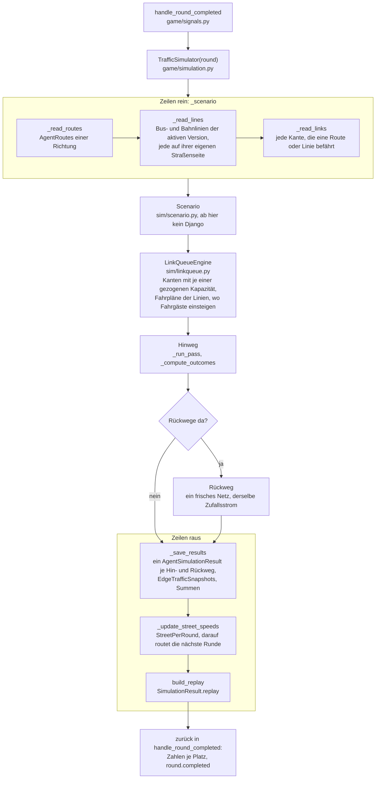

Der Zufall einer Runde ist aus ihrem pk geseedet (`TrafficSimulator(round, seed=…)`, um über mehrere
Seeds zu messen), eine Runde läuft also bei jeder Wiederholung gleich.

### Ein Durchlauf, Tick für Tick

Ein Durchlauf ist eine Richtung. Er läuft, bis alle angekommen sind; die Grenze von 1000 Ticks
(`PASS_TICK_GUARD`) fängt nur einen Bug ab, und wird sie erreicht, steht ein Fehler im Log.

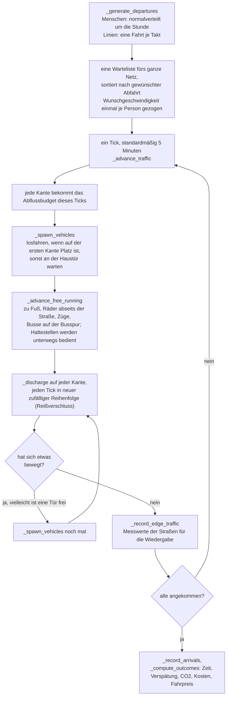

Der ÖPNV ist kein eigenes Modell. Eine Bus- oder Bahnfahrt ist ein ganz normales Fahrzeug auf
denselben Kanten, unter einem negativen Routenschlüssel (`route_pk < 0` heißt „eine Linie, kein
Mensch“). Fahrgäste warten in `stop_queues` je Linie und Haltestelle, steigen ein, solange Plätze
frei sind, und steigen aus, wo ihre Route die Linie verlässt (`_serve_stop`). Nach ihrem Fahrplan
fährt eine Linie weiter, solange überhaupt noch jemand unterwegs ist.

### Eine Kante

Was einem Auto auf einer Kante passiert. Eine Straße mit zwei Richtungen sind zwei Kanten, eine je
Richtung.

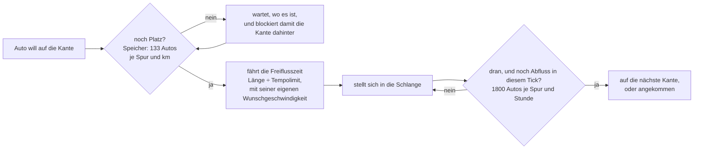

- **Wer Schlange steht:** Autos und Busse im Mischverkehr. Ein Rad auf einer Straße ohne Radspur hat
  auf der Kante eine eigene Schlange (`bike_queue`): Es nimmt Platz weg, wartet aber nie auf ein
  Auto. Wer zu Fuß geht, Züge, Wege ohne Straße und Busspuren laufen frei.
- **Zwei oder mehr Autospuren** bekommen eine Schlange je nächster Straße (`_pick_head`), ein Auto,
  das links abbiegt, hält also die nicht auf, die geradeaus fahren.
- **Eine volle Kante, die nie leer wird,** lässt nach `DEADLOCK_TICKS = 4` trotzdem ein Auto weiter,
  über ihren Speicher hinaus. Das wird gezählt (`forced_releases` im Log).
- **Geschwindigkeit ist ein Ergebnis.** Die Geschwindigkeit einer Kante ist ihre Länge durch die
  Zeit, die Autos wirklich gebraucht haben (`EdgeState.mean_speed_kmh`). Sie bestimmt CO2 und Kosten
  eines Autos auf dieser Kante, und die nächste Runde routet darauf.

## Zwischen den Runden

Die Phasen stehen in `game/phases.py`. Die Handys und die Spielleitung schicken ihren Teil über den
Spiel-Socket (`player.stats_ack`, `vote.open`, `vote.submit`, `stalemate.vote`,
`stalemate.force_leave`); `GameConsumer` reicht sie nur weiter. Die Namen in Großbuchstaben sind die
Phasen aus `GameRound.BetweenRoundPhase`.

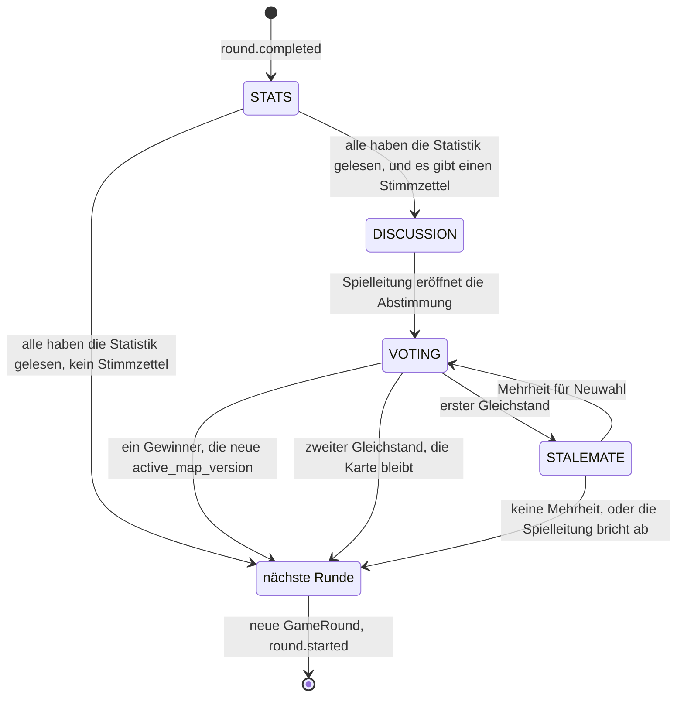

- **Jeder Pfeil wird beansprucht.** `_claim` setzt `GameRound.between_round_phase` mit einem
  bedingten `update()`, zwei Handys, die eine Phase im selben Augenblick abschließen, schalten sie
  also nur einmal weiter.
- **„Alle“ heißt die Plätze, die noch mitspielen** — `Player.objects.filter(game=…).playing()`,
  dieselbe Regel wie in der Runde. Geht jemand, läuft `phases.recheck`, weil das eine Phase
  abschließen kann.
- **Der Stimmzettel wird einmal gezogen** (`vote_options`, höchstens zwei Versionen) und an der Runde
  gespeichert, jedes Handy stimmt also über dieselben zwei ab.
- **Ein Spiel, das endet, hat keine Statistikphase.** Seine letzten Zahlen kommen mit
  `round.completed` und in der Zusammenfassung bei den Mitspielenden an.

## Vom Server auf den Bildschirm

Ein Socket je Spiel, ein Reducer. Der REST-Snapshot wird einmal gelesen, damit sofort etwas zu sehen
ist; danach gehört jedes Update dem Socket.

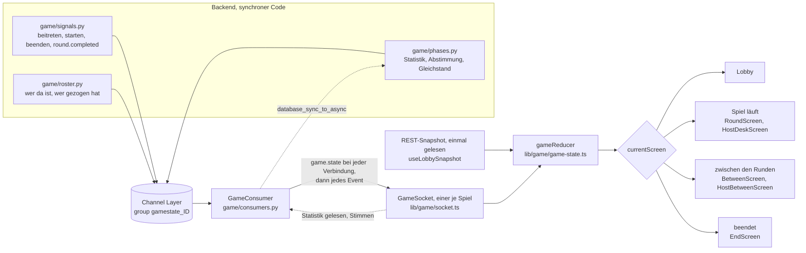

- **`game.state` kommt bei jeder Verbindung**, ein Reconnect ist also schon der Abgleich. Nichts
  fragt regelmäßig nach, nichts lädt neu.
- **Der Socket schlägt den Snapshot.** Der Roster kann vor dem Snapshot ankommen, und nur der Socket
  weiß, wer verbunden ist — sobald ein Roster da ist, rührt der Snapshot die Plätze also nicht mehr
  an.
- **`lib/game/events.ts` ist der ganze Socket-Vertrag** als eine typisierte Union. Ein neues Event,
  das der Reducer nicht behandelt, bricht den Build.
- **Gesendet wird nur aus synchronem Code.** `send_game_state_message` benutzt `async_to_sync`, und
  das verweigert auf der Event-Loop des Consumers den Dienst.

## Kartenversionen und Abstimmung

Eine Karte ist ein Graph; eine Version ist ein Filter darüber. Bei jedem Knoten, jeder Kante, jeder
Linie und jedem Linienabschnitt steht, in welchen Versionen sie vorkommen, und eine Zeile, die keine
Version nennt, kommt in keiner vor.

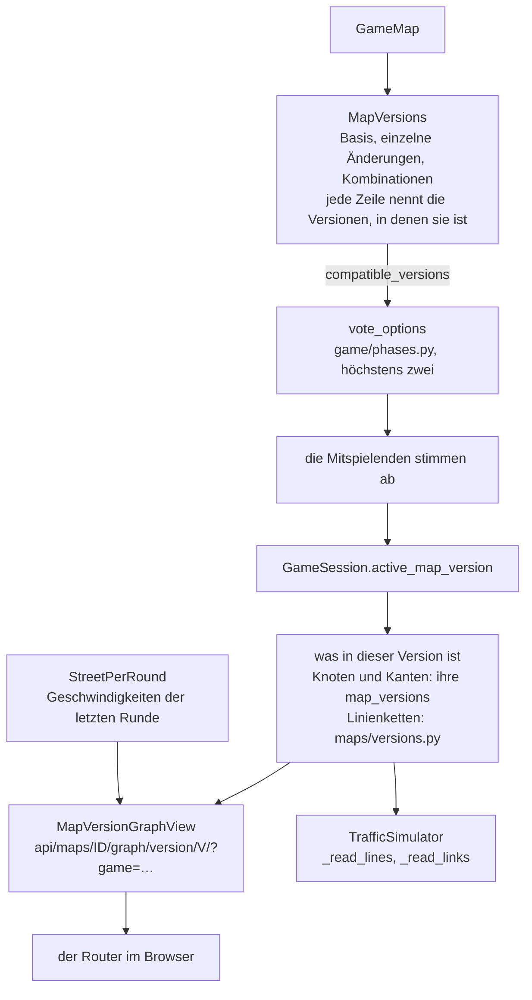

Die ganze Karte, mit jeder Version und dem Stimmzettel, geht als eine JSON-Datei rein und raus
(`api/maps/import/`, `api/maps/ID/export/`). Ein Import legt immer eine neue Karte an.
