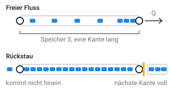
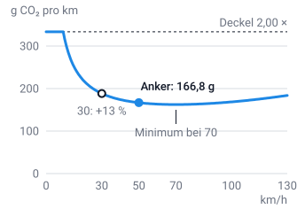
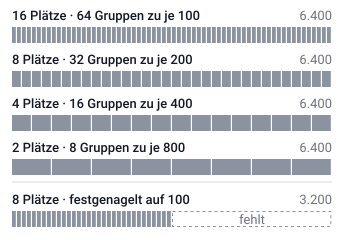
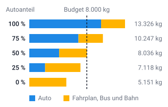

# Background

The idea for the game is based on the [master thesis](./../master_thesis.pdf) by Sebastian
Werblinski at Freie Universität Berlin (2025). The code here is a complete rewrite at TU Berlin
rather than a continuation of his prototype, and the traffic model was rebuilt along the way. This
section is how it calculates and where its numbers come from.

## Simulation

A round simulates the commute of thousands of people. The simulation has to answer three questions:

1. Which mode of transport is fastest?
2. Which mode of transport is cheapest?
3. Which mode of transport releases the least CO₂ into the atmosphere?

## Model

CO2mmute simulates traffic with a mesoscopic model. Vehicles form a queue on a stretch of road
without having an exact position on it. The stretches of road are the edges of a graph; where they
meet, there is a node.

### A link is three numbers

For the simulation every link has three core numbers:

```
free-flow time     t0 = length / speed limit
flow capacity      Q  = 1800 vehicles/h per car lane
storage capacity   S  = 133 vehicles/km per car lane × length
```

We take 1800 veh/h/lane as the saturation flow of an urban lane. 133 veh/km/lane is jam density:
one vehicle per 7.5 m, bumper to bumper. So a 900 m single-lane street holds about 120 vehicles
standing still and passes about 150 in a five-minute tick.

Lanes are counted as they are on the street:

```
car lanes = lanes − (1 if bus lane) − (1 if bike lane)
```

The number is floored at zero, and **zero car lanes is legal**: the street becomes a _gate_, closed
to cars, open to buses and optionally to bikes and pedestrians.

### One tick

1. Every link is given its budget for the tick: `Q × tick length`.
2. Everyone whose departure minute has come tries to enter their first link.
3. A vehicle may not leave a link before `t0` has passed. The free-flow time is a floor on the
   journey; it can never be faster than the speed limit allows.
4. Then it joins the link's FIFO queue and waits for budget.
5. It may only leave if the **next** link has storage left. If not it stays where it is, and so does
   everything behind it. A jam forms.
6. Repeat within the tick until nothing moves. A vehicle can cross several short links in five
   minutes.

So congestion comes from two mechanisms: a link discharges only `Q` vehicles per hour, and a full
link holds up the link feeding it. That is how queues grow backwards through the network, as they do
on a real street.



_Top: every car drives its free-flow time `t0` and joins a short queue at the end before the link
releases it at `Q`. Bottom: the next link is full, so nothing leaves, the queue fills the whole
storage `S`, and whoever arrives cannot get in. (Figure labels are in German, as on the site.)_

### The speed floor

Many traffic models compute a speed from the ratio of volume to capacity and therefore have to keep
it from reaching zero. Remember: dividing by zero is best avoided. A queue model has no such term. A
vehicle is either released or it is not, and there is no speed anywhere on the input side. So no
speed floor is needed.

In exchange, the network can gridlock for real: a ring of links, each full of vehicles wanting the
next one.

A junction that has moved nothing for four consecutive ticks therefore releases anyway, over
storage, and the release is counted. A non-zero `forced_releases` in the tick log is not a bug, but
it is a reason to read the log.

### Speed is an output

A link's mean speed is its length divided by the traversal times **actually observed on it**. Only
cars count: a pedestrian takes ten minutes over a link a car crosses in one, and letting walkers
into the mean would report an empty street as jammed. There is no congestion factor that a
free-flow speed gets multiplied by.

So the speed shown on the map, the CO₂ factor applied to a trip and the route preview a player gets
next round all rest on the same measured number.

### Who adds to congestion?

- **Cars** always.
- **Buses** queue in mixed traffic and free-run on a dedicated bus lane. A bus is 3 car-equivalents
  (PCU), so it takes the room of three cars in the queue it shares with them.
- **Bikes** are in traffic only where they share a street with cars. A bike has a queue of its own
  on the link, with its own discharge budget of 2000 bikes/h. So a car jam never holds a cyclist up
  and a cyclist never holds a driver up. They do share the link's _storage_, though: a bike is
  0.2 PCU, and that is how a thousand cyclists take room away from the cars. A bike is never refused
  entry, not even by a full street.
- **Pedestrians** are outside the queue model entirely.

## Public transport runs a timetable

In the simulation a line vehicle is an **ordinary vehicle on a synthetic route**. A bus therefore
queues and spills back like any car, unless it has a bus lane of its own.

People board at stops keyed by line _and_ node: someone waiting for the M1 does not get on the U7.
You can only board if there is room, otherwise you keep waiting. Seats free up when somebody gets
off. At a transfer you wait again, this time for the next line. The wait is measured and **reported
rather than added**: the clock has run since the minute the person wanted to leave, so standing at
the stop is already inside the trip time. Dwell time is not modelled; a vehicle serves its stop in
the instant it arrives.

A line runs its timetable whether anybody rides it or not:

> **Society pays for the timetable.** A line emits `vehicles × line-km × factor`. An empty bus emits
> CO₂ too, and a line nobody rode still costs the round.

That total is split between the riders by **person-kilometres**, not per head: someone riding one
stop on a 13 km line should not carry an end-to-end share while the car beside them is priced by the
kilometre. The personal shares add up to exactly the line's total: `Σ personal = society`.

So a round's total is the players' own rows **plus** the society cost of the lines nobody rode.

## CO₂ and cost ride a speed curve

Emissions are not a constant per kilometre. A car in stop-and-go traffic burns fuel it does not
convert into distance, and a car at 130 km/h is fighting drag. The model uses an average-speed
emission factor of the COPERT/HBEFA form:

```
EF(v) = a/v + b + c·v²          grams CO₂ per vehicle-kilometre
```

`a/v` is idling and stop-and-go, a fixed burn spread over fewer kilometres; `c·v²` is aerodynamic
drag; `b` is everything that scales with distance alone. `a` and `b` are **not free parameters**;
they follow from `c` and two conditions:

```
1.  the curve's minimum sits at 70 km/h   →   a = 2c · v_min³      = 1962.3 g/h
2.  EF(50) = 166.8 g/km, the car's factor →   b = 166.8 − a/50 − c·50²  = 120.4 g/km
```

with `c = 0.0028605`. That makes the anchor at 50 km/h hold exactly, and leaves one freely chosen
number instead of three.

| speed km/h | 10   | 20   | 30   | 40   | 50    | 70    | 100  |
| ---------- | ---- | ---- | ---- | ---- | ----- | ----- | ---- |
| g CO₂/km   | 317  | 220  | 188  | 174  | 166.8 | 162.5 | 169  |
| × the base | 1.90 | 1.32 | 1.13 | 1.04 | 1.00  | 0.97  | 1.01 |

`a/v` grows without bound as the speed goes to zero. So **the factor is capped at 2.00×** instead of
flooring the speed: at worst a car emits twice what it would at 50 km/h. The cap starts biting below
9.2 km/h.



_Grams of CO₂ per kilometre over the mean speed on a link. The anchor is at 50 km/h, the minimum at
70 km/h, and below 9.2 km/h the cap holds the curve at 333.6 g._

It follows that:

- **A Tempo-30 street emits about 13 % more per kilometre than a 50 street, even empty.** That is
  real in every average-speed model, and 34 of the shipped map's 82 street edges are 30 zones. It
  raises a round's emissions before there is any congestion.
- **Cost rides the same curve at half weight.** Half of the 0.32 €/km is fuel and stop-and-go wear
  and follows the emission factor; the other half (depreciation, insurance, tax) is paid whether the
  car moves today or not. So cost caps at 1.50× and CO₂ at 2.00×.

Public transport has a fixed value per vehicle-kilometre: 1200 g for a bus, 1500 g for a train.
There is no speed curve here, because the vehicles run to a timetable rather than to traffic.

Beside the cost there is the **fare**: 1.30 € per trip, transfers included, and for the car the part
of the cost paid out of pocket. So there is a difference between _what you pay_ and _what it costs_,
and the round's debrief should name it.

## Chance happens

The same choices in two rounds do not give quite the same numbers. That is intended. Each round
draws its random numbers from a generator whose seed is derived from the round, so the same round
can always be replayed identically.

Exactly two things are random:

- **Link capacity, drawn once per link per round** (σ = 0.14, clamped to 0.6–1.4×). This is the
  only one that makes round 2 differ from round 1, because per-driver noise averages away over
  thousands of people.
- **Desired speed, drawn once per driver** (σ = 0.12, clamped to 0.7–1.4×), for the spread _within_
  a round. On a multi-lane street the queue is ordered by when each vehicle is ready rather than
  strictly by arrival. That is how overtaking happens without a mechanism of its own.

The _result_ is never multiplied by a random number. Only the inputs are random, and close to
capacity the model amplifies their wobble. So a round barely varies in free flow (coefficient of
variation about 0.3 %) and clearly under load (16–18 %). As in real traffic, an empty road is
predictable and a jam is not.

**Delay is measured against the driver's own free-flow time.** Somebody who prefers 45 in a 50 zone
is not delayed by it.

## Units

A _Gruppe_ (an agent, in the research) stands for many commuters, and that factor is where most unit
bugs in this project came from. Two rules:

- A CO₂ or euro figure is **extensive**: it sums over agents and over the people behind each agent.
  Per-person means dividing by both.
- A trip time is **not**: two trips of 30 minutes each do not take 60 minutes together. So a mean
  trip time is a mean over the agents' trips.

Nobody picks how big the factor is; it is derived from the map.

## Calibration

The traffic physics above holds for every map: 1800 veh/h/lane and 133 veh/km/lane are measurements
from traffic engineering, and the emission curve hangs on its two anchor conditions. What changes
from map to map is the size of the world: how many people commute on the map and how much CO₂ a
round may cost. Both have to be measured for each map. If they are off, the game stops making sense:

- **Too many commuters**, and the network stands still whatever anyone plays. Berlin Mitte-West was
  first played at 1000 people per agent, which with every seat taken is 64 000 cars. The model
  handled it and reported a mean trip of **298 minutes for 7.66 km**.
- **Too few commuters**, and there is no jam for switching modes to clear.
- **A budget that is too tight** is spent in the first round, **one that is too generous** does not
  matter.

This chapter is how to find the two numbers for a map. Berlin Mitte-West, the map that ships with the
game, is the example.

### Two numbers per map

Every map carries:

```
district_commuters        commuters the map carries
co2_budget_kg_per_round   CO₂ budget per round, in kg
calibrated                whether both were measured on this map
```

The values are in the map's JSON file, can be changed in the admin, and travel with an export. A new
map takes 6400 and 8000 from Berlin Mitte-West until somebody measures it. Only once `calibrated` is
set does the notice on the create form go away.

Everything else is derived from them:

```
people_per_agent = district_commuters / (seats × agents per seat)
CO₂ budget       = budget per round × rounds
```

Whoever plays **divides** the map's commuters between the agents; more seats do not summon new
ones. So a round costs the same however many play, and the budget needs no seat term. That means
measuring once per map, not again for every number of players.

### Check the map data first

Calibration measures the map as it is in the file. If something there is broken, the calibration
measures the fault along with it. Check beforehand that:

- Every line runs its route without a gap.
- A line's outbound and return directions serve the same stops.
- Buses have 85 seats, trains 1000.
- Every home-and-workplace pair can be reached by public transport.

On Berlin Mitte-West one bus line at first had no edges at all, another broke mid-route, and every
vehicle had 60 seats. Six of the 36 pairs had no public transport connection as a result, and a
round with nobody in a car cost almost twice what it does today.
`backend/maps/tests/test_example_map.py` shows how to check this for the shipped map.

### Measure with test rounds

Measure with test rounds, not with a play-test. A play-test shows how a game feels, not how much
traffic a map carries.

1. Upload the map to a local instance (`devops/dev.sh up`), not to the server people play on.
2. Create a game with few seats. Turn map changes off so that every round runs on the base version,
   and set the CO₂ budget high enough that the game does not end.
3. Enter the candidate under "Menschen pro Gruppe": commuters ÷ (seats × agents per seat).
4. Add the seats at the Leitstelle (the host machine) and choose mode and route for every agent
   yourself.
5. After each round, read off CO₂ and the mean trip time. Under load a round varies by 16–18 %, so
   play several rounds with the same choices and average them.

If you program, you can also replay a finished round with `TrafficSimulator` from
`backend/game/simulation.py` at a fixed seed and average over as many seeds as you like.

Because the scale follows from the number of seats, a few seats are enough. On Berlin Mitte-West two
seats give almost the same round as sixteen:

| seats | agents | people/agent |   car CO₂ | mean trip | mean delay |
| ----: | -----: | -----------: | --------: | --------: | ---------: |
|    16 |     64 |          100 | 10 194 kg |  22.5 min |   12.5 min |
|     8 |     32 |          200 | 10 211 kg |  22.6 min |   12.6 min |
|     4 |     16 |          400 |  9 857 kg |  21.0 min |   11.0 min |
|     2 |      8 |          800 |  9 784 kg |  22.3 min |   12.5 min |



_Every row is the same 6400 commuters, only divided between agents differently. The last row holds
an agent at 100 people: with eight seats, only half the district is on the road._

CO₂ agrees within a good 4 %, delay within a minute and a half. Hold an agent at a fixed number of
people instead and a half-full game becomes a different game: 1.0 minutes of delay against 12.5,
and only 42 % of the CO₂.

### The commuter count

Pick the commuter count so that a morning on which everybody drives takes about as long as the rush
hour in the real city.

1. Work out the mean length of a commute on the map. On Berlin Mitte-West it is 7.66 km.
2. Look up how fast the morning peak flows in the city the map depicts. In inner Berlin it is
   roughly 24 km/h, so 19 minutes for 7.66 km.
3. Play test rounds in which everybody drives, and adjust the commuter count until the mean trip
   time lands in that range.

The result is not the district's real number of commuters, which is far higher. But the graph only
depicts the main corridors, and what you are after is how much traffic **those corridors** carry.
For Berlin Mitte-West it is **6400 commuters**: with everybody driving, 7.66 km then takes 22.5
minutes, 12.5 of them delay. That puts the model a little above the real city.

Then check that the jam depends on what players decide. That is what the game is about. Play rounds
with fewer cars, say three quarters, half and a quarter:

| car share | round total |       car | timetable | car trip | car delay |
| --------: | ----------: | --------: | --------: | -------: | --------: |
|     100 % |   13 059 kg | 10 194 kg |  2 864 kg | 22.5 min |  12.5 min |
|      75 % |    9 884 kg |  6 903 kg |  2 981 kg | 15.4 min |   5.4 min |
|      50 % |    7 184 kg |  4 164 kg |  3 020 kg | 10.6 min |   0.7 min |
|      25 % |    5 345 kg |  2 207 kg |  3 139 kg | 10.8 min |   0.1 min |
|       0 % |    3 194 kg |         — |  3 194 kg |        — |         — |



_Each bar is a round: the car in blue, the timetable in amber. The timetable runs either way and
only gets a little dearer as more people board; the car decides how long the bar is. The line is the
budget of 8000 kg a round._

On Berlin Mitte-West the jam is gone once half switch. Congestion is a threshold phenomenon close to
capacity: just below it traffic flows, just above it jams. If the jam stays at half the car share,
the commuter count is too high. If there is hardly a jam even when everybody drives, it is too low.

On public transport, too much demand shows up as waiting. On Berlin Mitte-West bus and train take 33
to 44 minutes, and the wait at the stop grows from 9 to 22 minutes as more people switch, because
the vehicles are full.

The table was measured on the base version of Berlin Mitte-West: 64 agents of 100 people each,
spread evenly over the 36 home-and-workplace pairs, everybody not driving on public transport,
averaged over six seeds. The spread between seeds is under 2 %.

### The budget

For the budget, measure two games over the planned number of rounds: one in which nobody gets out of
the car, and one that works its way down, for example at 100 / 75 / 50 / 50 / 25 / 25 % car share.
The budget has to lie between the two: the first game should break it, the second should get by on
it. The floor is the timetable, which runs without passengers too, on Berlin Mitte-West 2864 kg a
round. The number should be round so that everybody can keep it in their head.

On Berlin Mitte-West the first game costs 78 354 kg over six rounds, the second 48 001 kg. The
8000 kg a round on the map, 48 000 for six, sits right at the edge: driving throughout runs out in
round 4, and improving lands on the budget to the kilogram. At 9000 kg a round driving throughout
would only end in round 5, and switching would keep about six tonnes in hand. The next play-test is
to decide which number stays.

### Checking the emission factors

The emission factors hold for every map and live in `backend/sim/constants.py`. Each is per
vehicle-kilometre and has to be checkable:

| mode  | factor          | where it comes from                                              |
| ----- | --------------- | ---------------------------------------------------------------- |
| car   | 166.8 g/km      | fleet average, one person per vehicle                            |
| bus   | 1200 g/bus-km   | a 12 m city bus at ~45 l/100 km diesel × 2.64 kg CO₂ per litre   |
| train | 1500 g/train-km | ~4 kWh/train-km including auxiliaries × 363 g CO₂/kWh (UBA 2024) |

Check a factor through consumption: energy per vehicle-kilometre times CO₂ per unit of energy. That
is how the train factor was caught, which at first stood at 3500 g/train-km. That implies about
9.6 kWh per train-kilometre, a diesel mainline train. A Berlin U- or S-Bahn needs about 4 kWh,
which the German grid mix turns into 1450 g, rounded to 1500.

A wrong public transport factor weighs heavily, because the timetable runs without passengers too.
At 3500 g the timetable was 39 % of a round in which everybody drives; at 1500 g it is 22 %. Nobody
playing can do anything about that share.

Two rules:

- **Use the grid mix, not the operator's green tariff.** It is the conservative figure, and anyone
  can look it up.
- **Correct CO₂ and cost separately.** They come from different sources. Move the cost to follow a
  corrected CO₂ factor and the two metrics soon stop agreeing about which mode is expensive.

### The randomness stays

The random spread of link capacity (σ = 0.14) is the same for every map and is not retuned for a new
one. It was set over twenty seeds to 16–18 % variation under load: 0.10 gives 12.7 %, 0.18 gives
22.1 %.

The traffic literature suggests something nearer 25 %. But over half of real congestion comes from
accidents and weather, and none of that is in the model. Inflating capacity variance to cover it
would put a realistic-looking number on the screen for the wrong reason.

The general rule: where the model lacks a mechanism, name the gap rather than turning a parameter
until the output fits. The same rule is why overtaking on multi-lane streets is a queue ordering
rather than a smaller σ.

### When to measure again

The two numbers hold for one map and one model. Measure again when

- the map's capacity changes: new streets, different lanes, new lines;
- demand in the model changes. Departures are spread σ = 10 minutes around the departure hour today,
  far tighter than a real morning peak. Spread them wider and the same corridors carry more
  commuters;
- the evening commute is added. Today both directions of a street share one queue. That only works
  while everybody drives to work in the morning, and has to be split first;
- an emission factor changes. That moves the budget.

Then enter both numbers in the map file or in the admin, set `calibrated`, and export the map so the
measurement travels with the file. The measurements for Berlin Mitte-West, with every table, are in
`docs/kalibrierung.md` and `backend/game/calibration.py`.
