# How it runs

Flowcharts of the parts that are not standard Django: what talks to what, in which order, and where
in the code to start reading. Login, sign-up, password reset and the admin are left out — they are
what Django does anyway.

Every box names the file or function it stands for. The charts are [Mermaid](https://mermaid.js.org/);
GitHub draws them, and so does any editor with a Mermaid preview.

1. [The pieces](#the-pieces)
2. [A game, start to end](#a-game-start-to-end)
3. [Player authentication](#player-authentication)
4. [One round, end to end](#one-round-end-to-end)
5. [Finding a route in the browser](#finding-a-route-in-the-browser)
6. [The simulation](#the-simulation)
7. [Between rounds](#between-rounds)
8. [From the server to the screen](#from-the-server-to-the-screen)
9. [Map versions and the vote](#map-versions-and-the-vote)

## The pieces

One Django app on Daphne serves everything that is not the SPA: the REST API, the websockets and the
server-rendered pages. The simulation never runs in a request — it runs on a Celery worker, and its
results reach the browsers over the websocket.

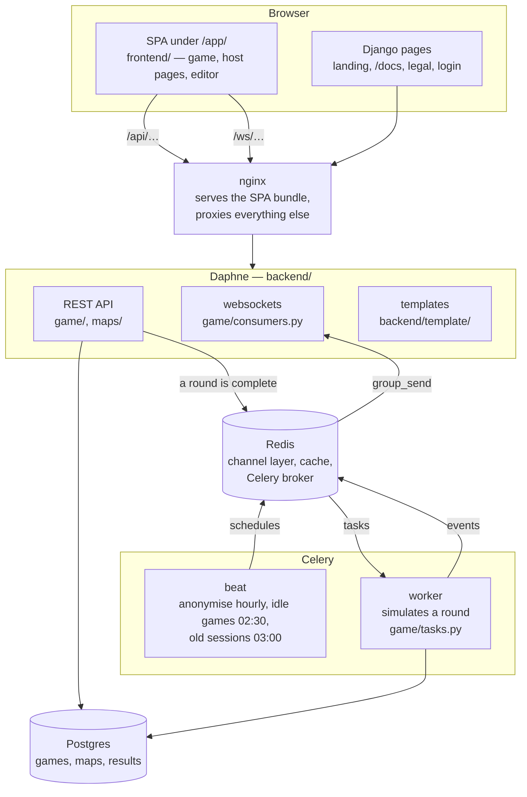

## A game, start to end

A game is a `GameSession`, a round a `GameRound`. The phases between rounds have a chart of their
own [further down](#between-rounds). Every ending writes `end_reason` at the moment it happens:
`co2_limit`, `max_rounds`, `host` or `idle`.

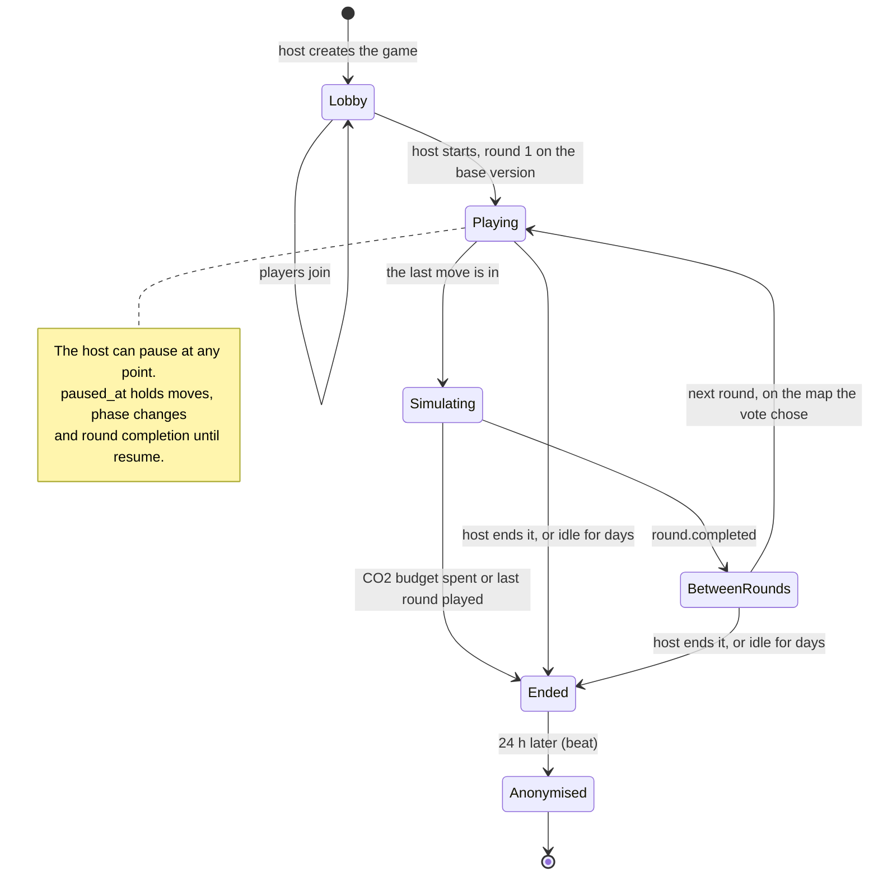

| step                                  | where to read                                                  |
| ------------------------------------- | -------------------------------------------------------------- |
| create                                | `GameSessionListCreateView` in `game/views_rest.py`            |
| join, home and destinations           | `JoinSessionAPIView` in `game/views_join.py`, `set_up_player` and `assign_agent_nodes` in `game/signals.py` |
| start                                 | `GameSessionDetailView.update` in `game/views_rest.py`         |
| round complete, simulate, end         | `game/rounds.py`, then `handle_round_completed` in `game/signals.py` |
| pause, idle end, anonymise            | `game/pause.py`, `game/idle.py`, `game/anon.py`                |

## Player authentication

Players have no account. Joining hands the browser two signed cookies, and every request and every
socket is checked against them. The host is an ordinary Django user with a session, and is checked
first.

### Getting a seat

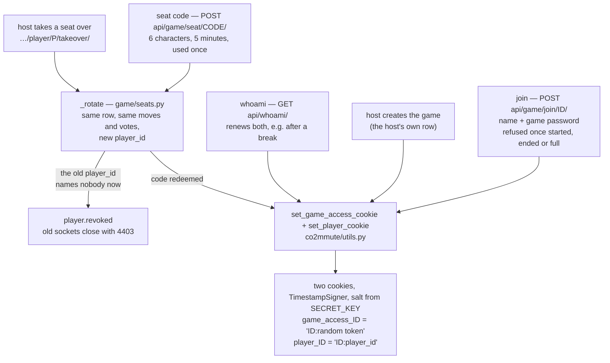

A seat is a `Player` row, and it can move between devices: the host takes a player's seat over to
play it at the Leitstelle, or hands a seat on with a code. Neither copies the row. `_rotate` gives it
a new `player_id`, so every cookie naming the old one stops working. A seat taken over needs no
cookie — the host acts for it with their session.

### Every request

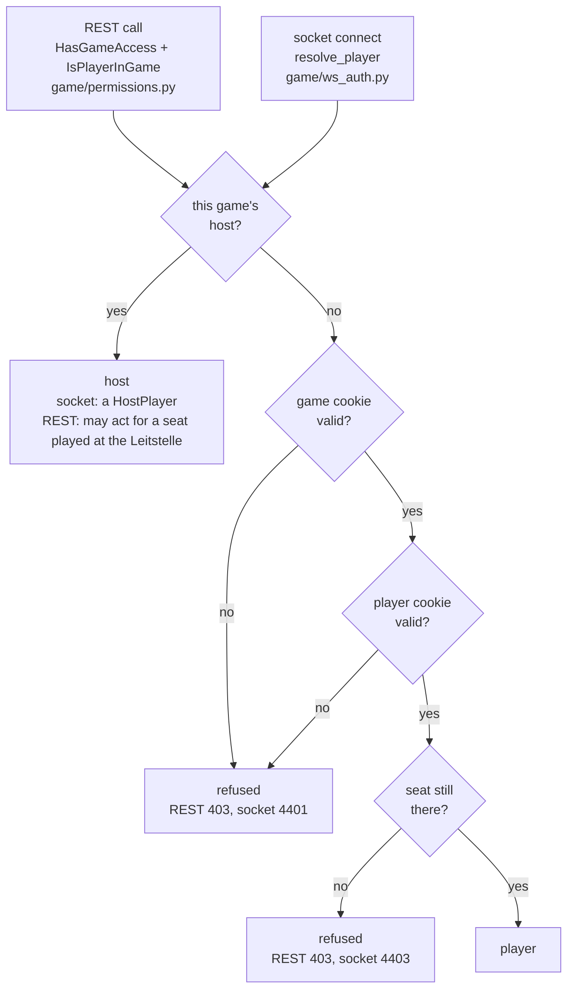

- **this game's host?** A logged-in Django user who is `game_host` of this game.
- **game cookie valid?** `has_game_access`: `game_access_ID` carries a good signature, has not
  expired, and the game id inside it is this game's.
- **player cookie valid?** `resolve_player_id`: the same checks on `player_ID`. On REST its
  `player_id` must also equal the one in the URL — every `player_id` is in the lobby roster, so
  without that any player could move for any other.
- **seat still there?** A `Player` row with that `player_id` that has not left. The socket also
  refuses a game that has ended.

Both doors go through `game/auth.py`, which knows nothing about the host. A refused socket is
accepted first and then closed with its code (`refuse()` in `game/consumers.py`) — closed before the
accept, the browser only sees 1006 and keeps reconnecting.

Two consequences: rotating `SECRET_KEY`, or changing what goes inside a cookie, logs every player
out of every running game. And a player's name is the only thing the game knows about them; it never
goes into a log.

## One round, end to end

From the first tap on a phone to the stats on every screen. The route is found in the browser, the
server only checks it. The round is complete the moment the last seat that is still playing has
moved; the simulation then runs on Celery and reports back over the websocket.

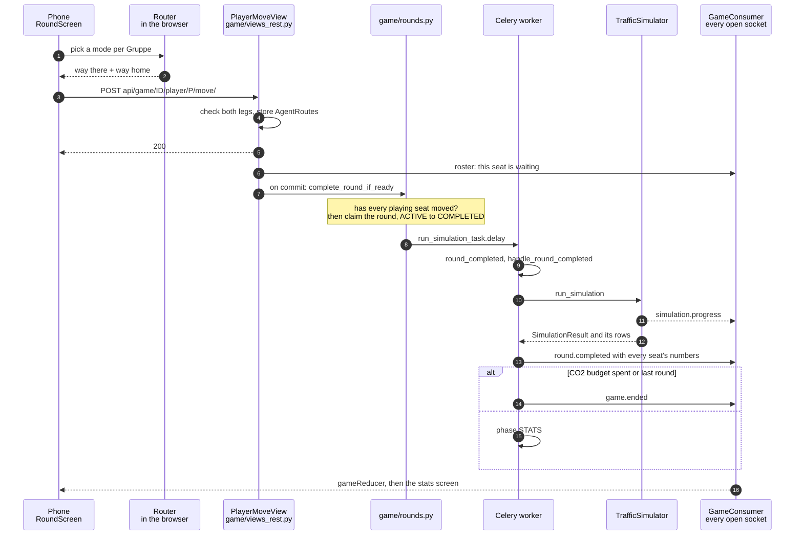

Two rules hold this together. There is **one** decision point, `complete_round_if_ready`, and
everything that can complete a round (a move, a player leaving) reaches it through
`schedule_round_completion_check`. And the round is **claimed** with a conditional `update()`, so two
moves arriving at the same instant start one simulation, not two.

## Finding a route in the browser

Everything here runs on the phone (`hooks/use-round-draft.ts`). The graph comes from the server once
per round and version, with last round's measured street speeds attached; the search itself is
Dijkstra.

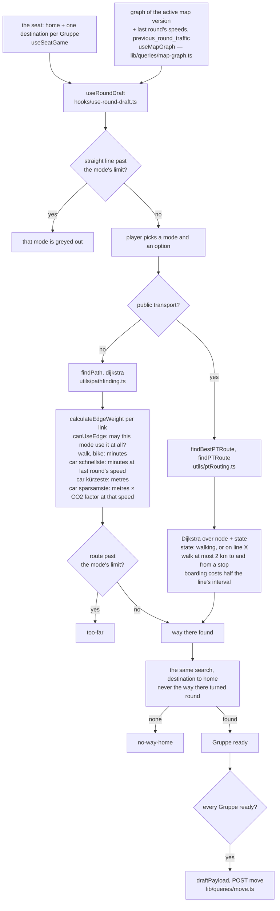

- **The limits** are walk 5 km and bike 15 km (`lib/map/trip-limits.ts`). The straight line is
  checked before a mode is picked — it can only be shorter than the route — and the found route
  after.
- **The way home is a search of its own.** A one-way street has no reverse edge, so on such a map
  the way home is a different route. The server refuses a move without one.
- **The server checks, it does not route.** `_validate_routes` in `game/views_rest.py` checks that
  both legs connect home and destination and that every link allows the mode.
- **Public transport has three options:** fastest, fewest changes (every change after the first
  boarding costs 30 extra minutes in the search) and no bus.
- **A slow search cannot overwrite a newer one.** Every search carries a token per Gruppe; a result
  whose token is no longer the current one is dropped.
- **Unfinished taps survive a reload** (mode and options only, never a route) in localStorage,
  `lib/game/draft-storage.ts`.

## The simulation

A link queue model, the mesoscopic model MATSim uses. What it calculates and why is in
[`docs/en-background.md`](en-background.md); these three charts show how the code is laid out.

### Rows in, engine, rows out

`game/simulation.py` is the adapter: it reads the round's rows into a `Scenario`, lets the engine
run, and writes the results. Everything under `sim/` is plain Python with no Django in it, so a test
or a calibration script can run a round without a database.

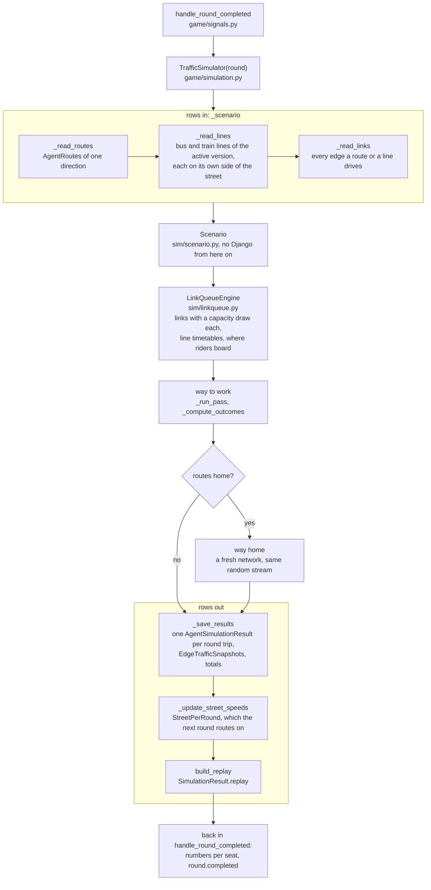

The round is seeded from the round's pk (`TrafficSimulator(round, seed=…)` to sweep), so a round
replays identically.

### One pass, tick by tick

A pass is one direction. It runs until everybody has arrived; the 1000-tick limit
(`PASS_TICK_GUARD`) only catches a bug, and hitting it is logged as an error.

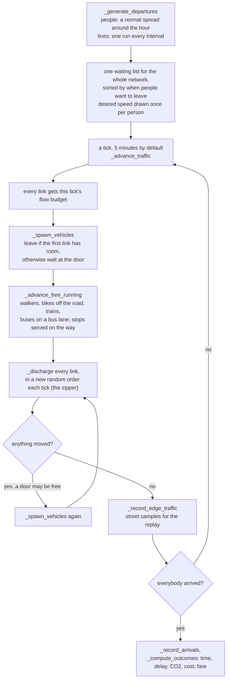

Public transport is not a separate model. A bus or train run is an ordinary vehicle on the same
links, under a negative route key (`route_pk < 0` means "a line, not a person"). Riders wait in
`stop_queues` per line and stop, board up to the free seats, and alight where their route leaves the
line (`_serve_stop`). Past its timetable a line keeps running as long as anybody at all is still out.

### One link

What happens to one car on one link. A two-way street is two links, one per direction.

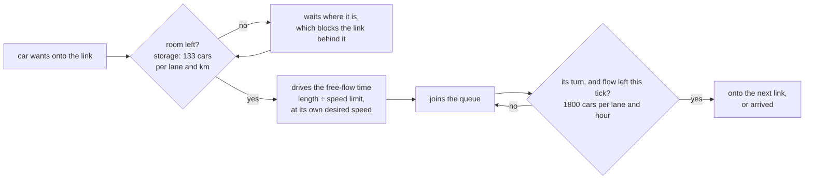

- **Who queues:** cars and buses in mixed traffic. A bike on a street with no bike lane has a line of
  its own on the link (`bike_queue`): it takes space, but never waits for a car. Walkers, trains,
  paths and bus lanes run free.
- **Two or more car lanes** get one queue per next street (`_pick_head`), so a car turning left does
  not hold up the ones going straight.
- **A full link that never empties** releases one car after `DEADLOCK_TICKS = 4` anyway, over its
  storage. That is counted (`forced_releases` in the log).
- **Speed is an output.** A link's speed is its length over the time cars actually took
  (`EdgeState.mean_speed_kmh`). That speed sets the car's CO2 and cost on it, and the next round
  routes on it.

## Between rounds

The phases live in `game/phases.py`. The phones and the host send their part over the game socket
(`player.stats_ack`, `vote.open`, `vote.submit`, `stalemate.vote`, `stalemate.force_leave`);
`GameConsumer` only passes them on. The names in capitals are the phases of
`GameRound.BetweenRoundPhase`.

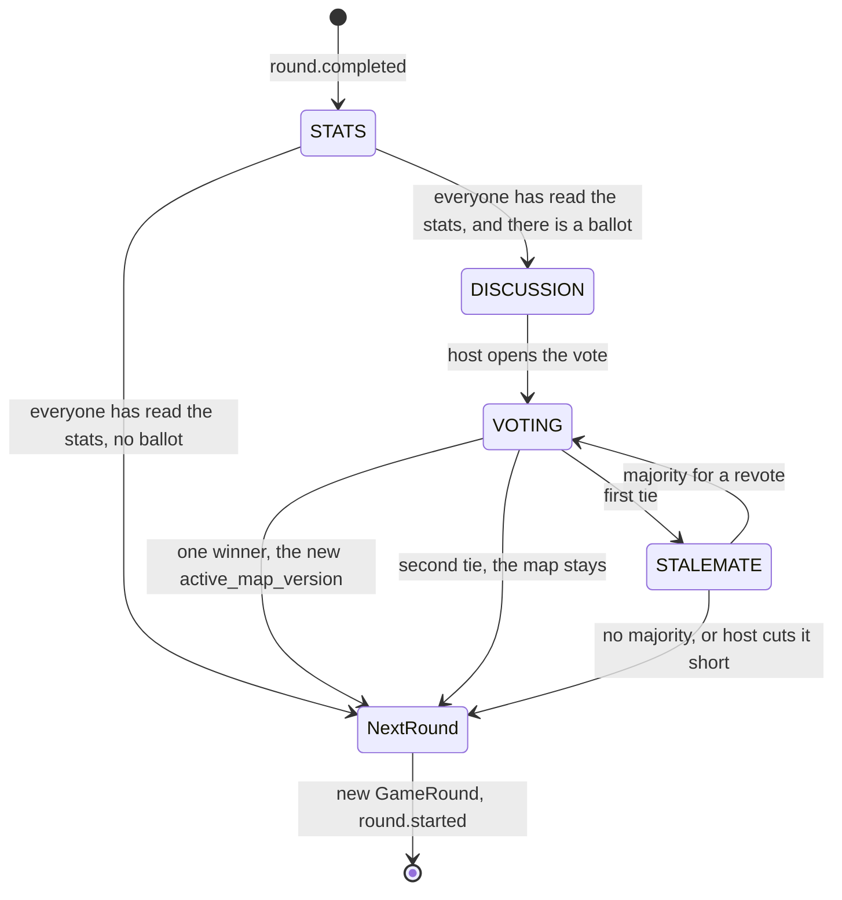

- **Every arrow is a claim.** `_claim` moves `GameRound.between_round_phase` with a conditional
  `update()`, so two phones finishing a phase at the same instant move it once.
- **"Everyone" means the seats still playing** — `Player.objects.filter(game=…).playing()`, the same
  rule the round uses. When someone leaves, `phases.recheck` runs, since that can complete a phase.
- **The ballot is drawn once** (`vote_options`, at most two versions) and stored on the round, so
  every phone votes on the same two.
- **A game that ends has no stats phase.** Its last numbers reach the players with `round.completed`
  and on the summary.

## From the server to the screen

One socket per game, one reducer. The REST snapshot is read once to draw something at once; after
that the socket owns every update.

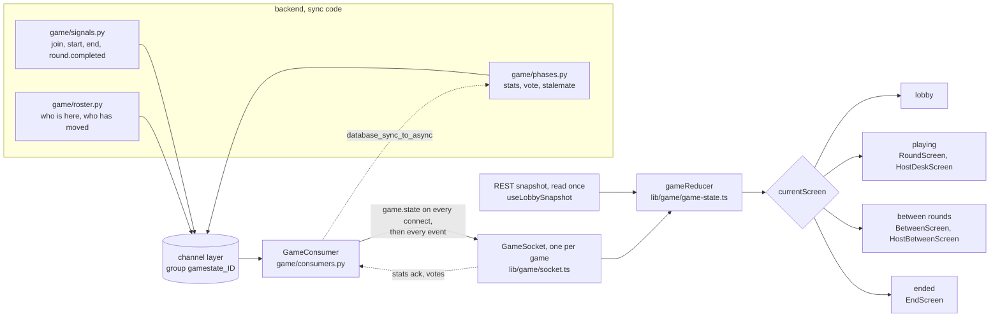

- **`game.state` arrives on every connect**, so a reconnect is the resync. Nothing polls and nothing
  refetches.
- **The socket wins over the snapshot.** The roster can arrive before the snapshot does, and only the
  socket knows who is connected — so once a roster has arrived, the snapshot no longer touches the
  seats.
- **`lib/game/events.ts` is the whole socket contract** as one typed union. A new event the reducer
  does not handle breaks the build.
- **Broadcast from sync code only.** `send_game_state_message` uses `async_to_sync`, which refuses to
  run on the consumer's event loop.

## Map versions and the vote

A map is one graph; a version is a filter over it. Every node, edge, line and line segment says
which versions it is in, and a row naming no version is in none.

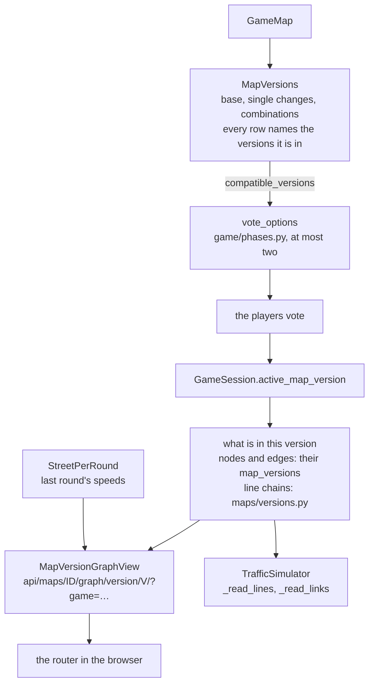

The whole map, every version and the ballot included, goes in and out as one JSON file
(`api/maps/import/`, `api/maps/ID/export/`). An import always creates a new map.
